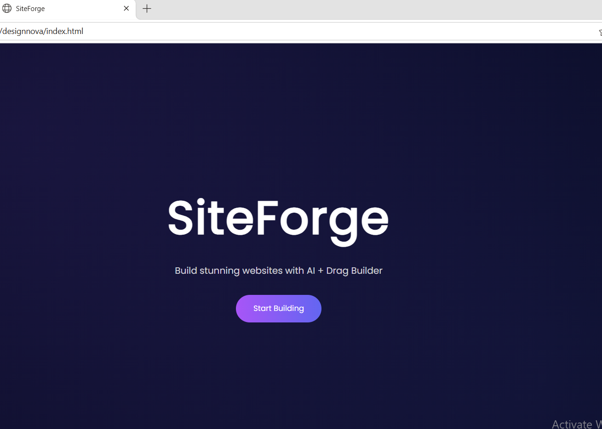
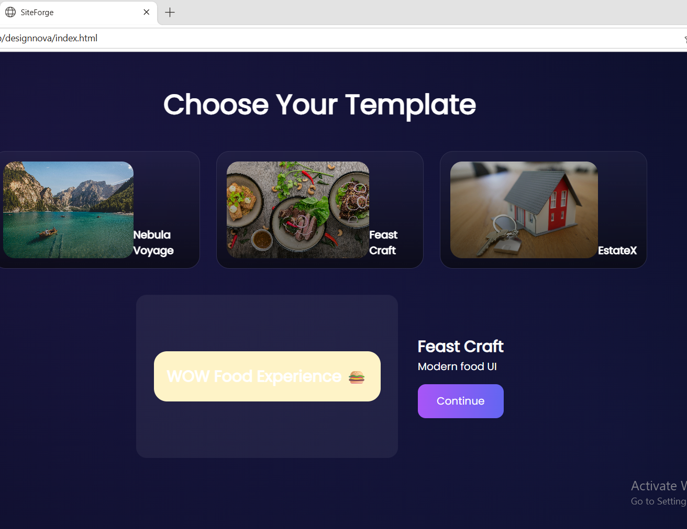
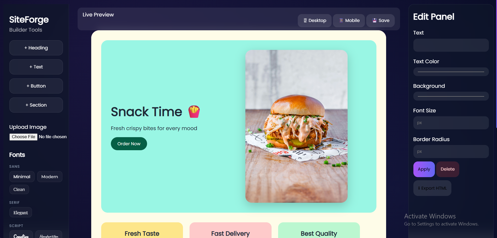
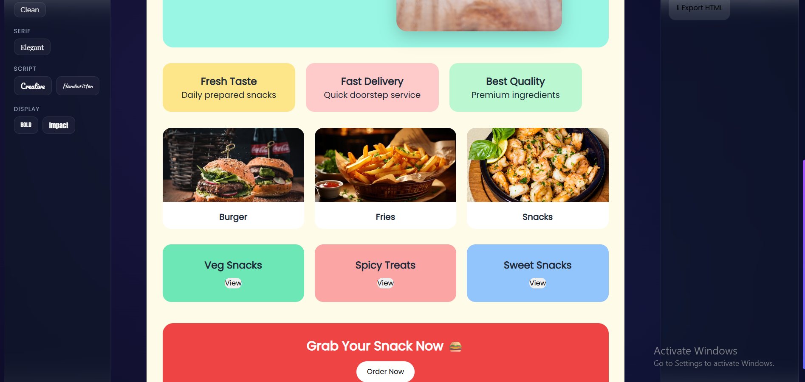
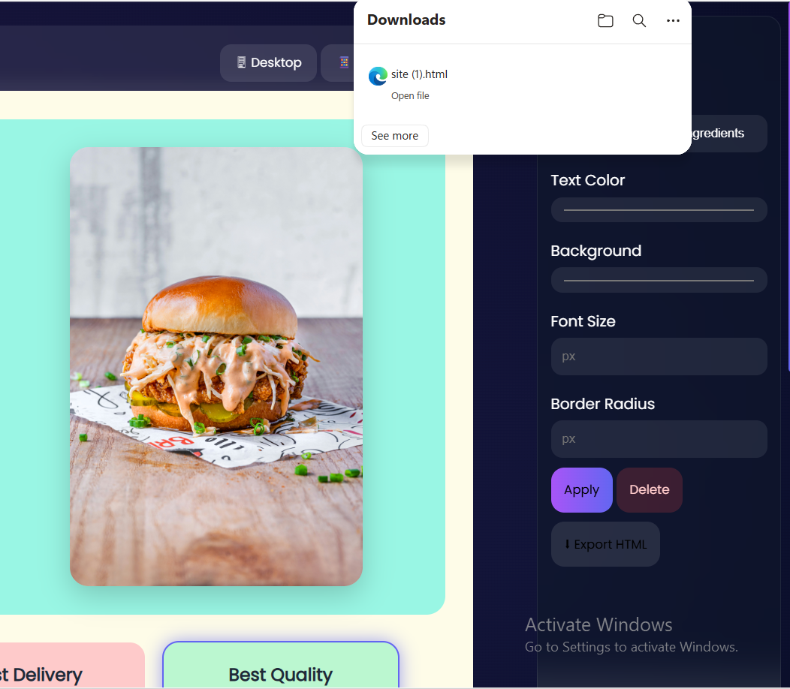

# SiteForge

SiteForge is a web-based website builder that I developed to understand how drag-and-drop website creation tools work.

The application allows users to select from different templates and build a webpage by adding elements like headings, text, buttons, and sections. These elements can be repositioned and customized using an edit panel, where users can modify text, colors, font size, and other properties.

It also includes features like image upload, saving layouts using localStorage, and exporting the final design as an HTML file.

## Tech Stack
- HTML
- CSS
- JavaScript

## Key Features
- Template selection system  
- Drag-and-drop element positioning  
- Real-time editing panel  
- Image upload functionality  
- Save and export options  

## How to Run
Open the `index.html` file in a browser.

## What I Learned
- DOM manipulation in JavaScript  
- Handling user interactions and events  
- Managing UI state across multiple sections  
- Implementing drag-and-drop behavior  

## Screenshots

### Landing Page

### Template Selection

### Builder Interface (Editing View)

### Builder Interface (Final Layout)

### Export Feature

## Note
This is a self-developed project created to explore frontend development and build a functional interactive tool.
